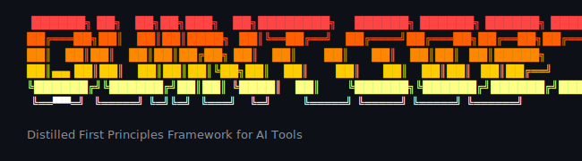

**Structured reasoning for AI coding tools** — make better decisions, remember why you made them.

**Supports:** Claude Code, Cursor, Gemini CLI

> **Works exceptionally well with Claude Code!**

## The Problem

Your AI tool gives you *an* answer. But why this approach? What alternatives were considered? What evidence supported it? When does the decision expire?

Quint Code gives you a structured way to reason through decisions — generate hypotheses, verify them, and document *why* you chose what you chose.

## Quick Start

### Install

The installation is only **per-project**. Why? Because quint-codes mcp server manages Bounded Contexts, well... Per context.
And by the high-scope contexts we are taking the directory. It can be github repo, it can be just a directory with
documents and other assets you are performing you studyings on.

```bash
cd /path/to/your/project
curl -fsSL https://raw.githubusercontent.com/m0n0x41d/quint-code/main/install.sh | bash
```

The installer will create `.quint/`, installs the MCP server, and add slash commands for your AI tool using their configd irectories (e.g. `.claude`` and so on).

### Initialize

```bash
/q0-init   # Scans context and initializes knowledge base
/q1-hypothesize "How should we handle state sync across browser tabs?"
```

## How It Works

Quint Code implements the **[First Principles Framework (FPF)](https://ailev.livejournal.com/)** by Anatoly Levenchuk — a methodology for rigorous, auditable reasoning.

The core cycle: **Abduction → Deduction → Induction**

1. **Abduction** — Generate competing hypotheses (don't anchor on the first idea)
2. **Deduction** — Verify logic and constraints (does it even make sense?)
3. **Induction** — Gather evidence through tests or research (prove it works)

Then audit for bias, decide, and document the rationale.

See [docs/fpf-engine.md](docs/fpf-engine.md) for the full breakdown.

## Commands

| Command | What It Does |
|---------|--------------|
| `/q0-init` | Initialize `.quint/` and record context |
| `/q1-hypothesize` | Generate hypotheses |
| `/q2-verify` | Verify logic, promote to L1 |
| `/q3-validate` | Test or research, promote to L2 |
| `/q4-audit` | Bias check and trust scoring |
| `/q5-decide` | Finalize and create Design Rationale Record |
| `/q-status` | Show current state |
| `/q-decay` | Check for expired evidence |

## Documentation

- [FPF Engine Details](docs/fpf-engine.md) — ADI cycle, commands, when to use
- [Architecture](docs/architecture.md) — Internals, knowledge levels, Transformer Mandate

## License

MIT License. FPF methodology by [Anatoly Levenchuk](https://ailev.livejournal.com/).
